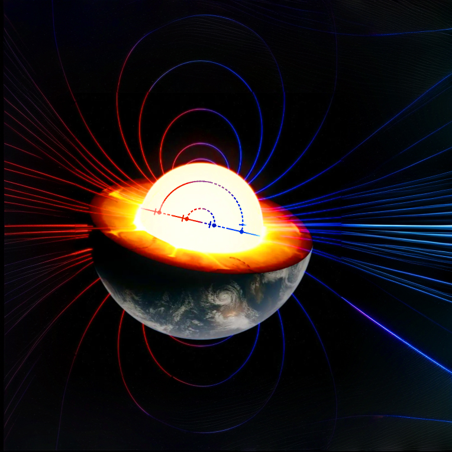
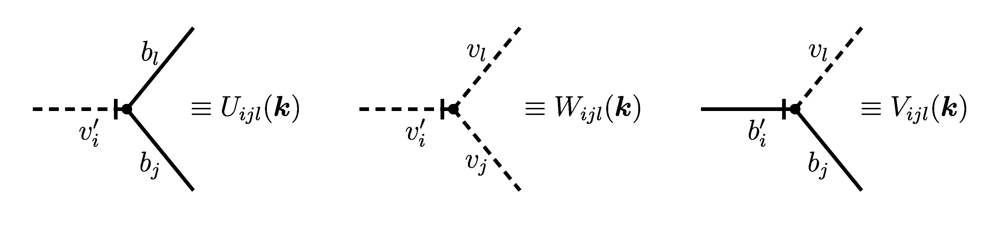

<!-- PROJECT SHIELDS -->
<!--
*** I'm using markdown "reference style" links for readability.
*** Reference links are enclosed in brackets [ ] instead of parentheses ( ).
*** See the bottom of this document for the declaration of the reference variables
*** for contributors-url, forks-url, etc. This is an optional, concise syntax you may use.
*** https://www.markdownguide.org/basic-syntax/#reference-style-links
-->

# **Two-loop helical MHD diagrams: tensor and scalar structures** 

<div align="center">
  <a href="https://www.sympy.org/en/index.html">
    
  </a>    
  <a href="https://www.python.org/">
    
  </a>
</div>

<div align="center">
  
</div>


<!-- PROJECT LOGO -->
<br />
<div align="center">
  
</div>


## **The Repository**

This repository is dedicated to working with two-loop diagrams of stochastic magnetohydrodynamics. 
The final version of this source code will be available to everyone.


<!-- TABLE OF CONTENTS -->
## **Table of Contents**

- [About The Project](#about-the-project)
  - [Built With](#built-with)
- [Theory](#theory)
  - [Microscopic Foundation of the Model](#microscopic-foundation-of-the-model)
  - [Field Theory Formulation](#field-theory-formulation)
  - [Instability Mechanism and Computed Objects](#instability-mechanism-and-computed-objects)
  - [Diagram Technique](#diagram-technique)
    - [Nickel Index](#nickel-index)
    - [Feynman Rules](#feynman-rules)
  - [Frequency Integration](#frequency-integration)
  - [Computing Tensor Convolutions](#computing-tensor-convolutions)
- [Program Operation Algorithm](#program-operation-algorithm)
  - [Getting diagram structure from Nickel index](#getting-diagram-structure-from-nickel-index)
  - [Computing scalar and tensor structures](#computing-scalar-and-tensor-structures)
  - [Preparing integrand for numerical calculation](#preparing-integrand-for-numerical-calculation)
- [Getting Started](#getting-started)
  - [Prerequisites](#prerequisites)
  - [Installation](#installation)
- [Contact](#contact)
- [References](#references)


<!-- ABOUT THE PROJECT -->
## **About The Project**
This program aims to obtain and perform partial symbolic calculations to prepare integrands of the UV-finite two-loop Feynman self-energy contributions in stochastic gyrotropic magnetohydrodynamics (MHD) for subsequent numerical integration. The instability caused by the nonconservation of spatial parity in a turbulent system, also known as gyrotropy, can in principle be stabilized by the presence of a large-scale homogeneous magnetic field in the system, as has been shown in [[1]](#references). This proof is based on the one-loop calculations, while this program is designed to surpass the one-loop approximation.

### **Built With**

This section contains a list of any major frameworks/libraries used to bootstrap of the project.
* [![sympy][sympy.logo-shield]][sympy-url]


<!-- THEORY -->
## **Theory**
More information about the model can be found in [[1, 2]](#references). Used notation can be also found in the file [General_notation](/General_notation.txt).

### **Microscopic Foundation of the Model**
**Stochastic MHD.** 
MHD problem is governed by two coupled equations 

$$
\begin{align*}
&\boldsymbol{\nabla}_t \boldsymbol{v} = \nu_0 \boldsymbol{\nabla}^2 \boldsymbol{v}  + (\boldsymbol{b} \cdot \boldsymbol{\nabla}) \boldsymbol{b} - \boldsymbol{\nabla} P + \boldsymbol{F}^{v}, \\ 
&\boldsymbol{\nabla}_t \boldsymbol{b} = \nu_0 u_0 \boldsymbol{\nabla}^2 \boldsymbol{b} +  (\boldsymbol{b} \cdot \boldsymbol{\nabla}) \boldsymbol{v} + \boldsymbol{F}^{b},
\end{align*}
$$

with Lagrangian derivative $\boldsymbol{\nabla}_t \equiv \partial_t + (\boldsymbol{v} \cdot \boldsymbol{\nabla})$. The problem is studied in $d$-dimensional (for generality) space $\boldsymbol{x} = \{x_i\}$, $i = 1 \ldots d$, standard conventions for summation and integration, as well as condensed notation for Lagrangians, are assumed throughout.

Here $\nu_0$ is the molecular kinematic viscosity, $u_0$ is the dimensionless constant - reciprocal Prandtl number ($\nu_0 u_0 = c^2/4 \pi \sigma_0$, where $c$ is the light speed and $\sigma_0$ is the constant turbulent medium conductivity). 
Vector function $\boldsymbol{b} (\boldsymbol{x}, t) \equiv \boldsymbol{B_0}(\boldsymbol{x}, t)/(4\pi \rho_0)^{1/2}$ denote a magnetic field $\boldsymbol{B_0}(\boldsymbol{x}, t)$ advected by turbulent flow with a constant density $\rho_0$, $\boldsymbol{v} (\boldsymbol{x}, t)$ is a velocity field, and stochastic functions $\boldsymbol{F}^v (\boldsymbol{x}, t)$ and $\boldsymbol{F}^b (\boldsymbol{x}, t)$ are external random forces per unit density.
The scalar function $P (\boldsymbol{x}, t)$ represents pressure field per unit density and is not relevant in the following analysis due to the following transversality conditions

$$
\begin{equation*}
\boldsymbol{\nabla} \cdot \boldsymbol{b} = \boldsymbol{\nabla} \cdot \boldsymbol{v} = \boldsymbol{\nabla} \cdot \boldsymbol{F}^v = \boldsymbol{\nabla} \cdot \boldsymbol{F}^b = 0.
\end{equation*}
$$

The most striking manifestation of a turbulent dynamo is the generation of a magnetic field in the absence of magnetic noise, i.e., at $\boldsymbol{F}^b = 0$. In this case, only the correlator $\langle \boldsymbol{F}^v \boldsymbol{F}^v \rangle$ is nonzero.

**Correlator of the random force.** 
As in all RG models of the developed turbulence theory, the corresponding model is determined by the choice of the random force correlator $\mathrm{D}^v$. We consider the model of homogeneous and isotropic three-dimensional turbulence with the $\delta$-shaped pumping modeling energy injection to the system by infinitely large eddies. In this way, $\boldsymbol{F}^v$ simulates the energy introduced into the system on a large scale. The statistics of the external force is assumed to be Gaussian with zero mean, uncorrelated in time with a given correlator

$$
\begin{align*}
&\mathrm{D}_{i j}^v(\boldsymbol{x}, t, \boldsymbol{x}', t') \equiv \langle F_i^v (\boldsymbol{x}, t) F_j^v (\boldsymbol{x}', t') \rangle = \\
&\delta (t - t') \int \limits_{|\boldsymbol{k}| < \Lambda} \frac{d \boldsymbol{k}}{{(2 \pi)}^3} d_F(k) R_{i j}(\boldsymbol{k}) e^{i \boldsymbol{k} \cdot (\boldsymbol{x} - \boldsymbol{x}')},
\end{align*}
$$

where $d_F(k) = g_0 \nu_0^3 k^{1 - 2 \varepsilon}$ is the so-called pump function. Hereinafter $k = |\boldsymbol{k}|$ is the wavenumber, parameter $g_0$ plays the role of a coupling constant (expansion parameter in perturbation theory) connected to the typical UV momentum scale $\Lambda$ through $g_0 \simeq \Lambda^{2 \varepsilon}$, and $\varepsilon$ is the model parameter characterizing the type of pumping. The exponent $0 \leqslant \varepsilon \leqslant 2$ plays a role similar to the parameter $(4 - d)$ in the RG theory of critical behavior in the sense that the various scaling dimensions are calculated as an expansion $\varepsilon$. The most realistic values of the corresponding quantities (for example, scaling dimensions) are obtained in the limit $\varepsilon \rightarrow 2$ in which the function $d_F(k)$ can be understood as a power-law equivalent of idealized $\delta$-shaped pumping. 

Note that in this problem we are interested in a phenomenon that is fundamentally undetectable within the traditional scheme with dimensional regularization (counterterms such as mass renormalization) [[1]](#references). This leads us to consider the model using a more complex two-parameter $(\Lambda, \varepsilon)$-regularization. In such regularization, UV-finiteness denotes both limits $\Lambda \rightarrow \infty$ and $\varepsilon \rightarrow 0$.

The final definition of the correlator reduces to the definition of the tensor quantity $R_{i j}(\boldsymbol{k})$ defined below.

**Helical turbulence.**
We consider developed turbulence with helicity, which from a point of view of $\boldsymbol{F}^v$ means, for instance, turbulence in a rotating medium, generated to sense differences in angular velocity directions. The existence of nonzero helicity imposes additional conditions on the energy source of incompressible fluid flow, i.e. to the correlator $\mathrm{D}^v$.

From a symmetry point of view, helical turbulence can be understood as turbulence in a system (chiral media) that is invariant under translations and rotations, but not under plane reflections. 
This implies the non-vanishing of the helicity $\langle \boldsymbol{v} \cdot\text{curl }\boldsymbol{v} \rangle$, i.e. existense of the correlation between velocity $\boldsymbol{v}$ and vorticity $\text{curl }\boldsymbol{v}$. Thus, we consider a model with a less rich group of global symmetries than the Galilean group $\mathbb{G}(1,3)$ (here we mean precisely three-dimensional case). In our case, the parity symmetry $\mathbb{Z}_2^P \equiv \{  \mathbb{1}_3, P_3 \} = \mathbb{O}(3)/\mathbb{SO}(3)$, is somehow violated.

Technically, the rejection of spatial parity conservation means that the correlator $ \mathrm{D}_{i j}^v $ is a mixture of a parity-even (tensor) and a parity-odd (pseudotensor) contributions, i.e. in case of incompressible fluid $R_{i j}(\boldsymbol{k})$ is equal to the sum of the transverse projection operator $P_{i j} (\boldsymbol{k}) \equiv \delta_{i j} - k_i k_j/k^2$ and a so-called Helical term  $H_{i j} (\boldsymbol{k}) \equiv i \epsilon_{i j l} k_l/k$

$$
\begin{equation*} 
R_{i j} (\boldsymbol{k}) = P_{i j} (\boldsymbol{k}) + \rho H_{i j} (\boldsymbol{k}),
\end{equation*} 
$$ 

where $\epsilon_{ijl}$ is a fundamental antisymmetric tensor, and helicity parameter $\rho$ shows the amount of reflection symmetry breaking ($|\rho| \leqslant 1$).

### **Field Theory Formulation**
The stabilized (see below) stochastic helical MHD problem is equivalent to a multiplicatively
renormalizable field-theoretic model with the set of fields $\Phi = \{ \boldsymbol{v}, \boldsymbol{b}, \boldsymbol{v'}, \boldsymbol{b'} \}$ [[1]](#references). Its field action is the corresponding De Dominicis–Janssen MHD action functional has form

$$
\begin{align*}
&\mathcal{S} = \frac{1}{2}  \boldsymbol{v'} \mathrm{\hat D}^v \boldsymbol{v'} + \\
&\boldsymbol{v'} \left(-\nabla_t \boldsymbol{v} + {\nu}_0 \boldsymbol{\nabla}^2 \boldsymbol{v} + (\boldsymbol{b} \cdot \boldsymbol{\nabla}) \boldsymbol{b} + ({\bf B} \cdot \boldsymbol{\nabla}) \boldsymbol{b}\right) +\\
&\boldsymbol{b'}\left(-\nabla_t \boldsymbol{b} + u_0 {\nu}_0 \boldsymbol{\nabla}^2 \boldsymbol{b} +  (\boldsymbol{b} \cdot \boldsymbol{\nabla}) \boldsymbol{v} + ({\bf B} \cdot \boldsymbol{\nabla}) \boldsymbol{v}\right).
\end{align*}
$$

Here parameter ${\bf B}$ is a spatially homogeneous magnetic field that stabilizes the system (see the next section for more information), fields with primes (transverse) denote the response fields, and the hat hereinafter denotes the matrix by spatial indices $\mathrm{\hat D}^v = [\mathrm{D}^v_{i j}]$.

### **Instability Mechanism and Computed Objects**
Generally speaking, the transition from stochastic MHD to the field formalism results in the action $\mathcal{S}$ at ${\bf B} = 0$. Let's consider correlation functions $\langle v_i v'_j \rangle$ and $\langle b_i b'_j \rangle$ in this model (with ${\bf B = 0}$).
They have the meaning of response functions characterizing the linear response of the system to an arbitrary perturbation by an external (nonrandom) force. Therefore, they must be retarded and ensure the damping of any perturbations in a stable system.

Functions $\langle v_i v'_j \rangle$ and $\langle b_i b'_j \rangle$ can be found from the following Dyson equations

$$
\begin{align*}
&\langle v_i^{~} v_j' \rangle^{-1}(\omega, \boldsymbol{p}) = (-i \omega + \nu_0 p^2)P_{i j}(\boldsymbol{p}) - \Sigma_{i j}^{v' v}(\omega, \boldsymbol{p}), \\
&\langle b_i^{~} b_j' \rangle^{-1}(\omega, \boldsymbol{p}) = (-i \omega + u_0 \nu_0 p^2)P_{i j}(\boldsymbol{p}) - \Sigma_{ij}^{b' b}(\omega, \boldsymbol{p}), 
\end{align*}
$$

where $\Sigma_{ij}^{v'v}$, $\Sigma_{ij}^{b'b}$ are self-energy corrections given by infinite series of diagrams.
 
According to the analysis carried out in [[1]](#references) at the level of one-loop perturbation theory, in a chiral media $\Sigma_{ij}^{b' b}$ has contribution $\sim H_{i j}(\boldsymbol{p})$ (the so-called solenoidal term, since in the coordinate representation this term corresponds to the addition of $\text{curl } \boldsymbol{b}$ to the right side of the corresponding "magnetic" equation of motion) that lead to instability. 
This instability, in turn, leads to the appearance in the system of an anomalous large-scale homogeneous magnetic field $\langle\boldsymbol{b}\rangle \equiv {\bf B} \not = 0$. This phenomenon is called the _turbulent dynamo_. 

It is also important to note that the model under consideration differs from those typical for QFT or theory of critical phenomena in that here the stationarity condition for the generating functional of 1-irreducible Green's functions (effective action) $\delta_{\alpha}\Gamma_{ij}^{b'b}(\alpha)\Big|_{\langle\boldsymbol{b'}\rangle = \langle\boldsymbol{v'}\rangle = 0} = 0$ does not fix the spatially homogeneous mean $\langle\boldsymbol{b}\rangle$ [[1]](#references). Therefore, to justify the appearance of the non-zero mean field ${\bf B}$ and to define it in our model, it was proposed to act differently, namely, straightforwardly: assuming the appearance of a mean field, let's see how it affects the solenoidal terms that cause instability. This program results in an action $\mathcal{S}$. If it is possible to make them disappear by a suitable choice of ${\bf B}$, then this ${\bf B}$ will be the desired one.

From a general analysis of the tensor structure of self-energy graphs we can obtain the asymptotic behavior of $\Sigma_{ij}^{b' b}$ in the following form

$$ 
\begin{align*}
&\Sigma_{i j}^{b' b}(0, \boldsymbol{p}) \sim i \epsilon_{i j k} p_k T_{l j} \quad \text{as} \quad p \rightarrow 0, \quad \text{where} \\
&T_{lj} = (a\Lambda - b|{\bf B}|)\delta_{lj} + c\hat B_l \hat B_j, \quad \hat B \equiv {\bf B}/|{\bf B}|.
\end{align*}
$$

Note that in our case of zero external momenta the procedure for reducing tensor integrals to scalar ones (Veltman-Passarino reduction) allows only tensor structures of the form of $\delta_{lj}$ and $\hat B_l \hat B_j$. In principle, a contribution of the form $\sim i (\boldsymbol{p} \cdot {\bf B})\epsilon_{i j k}B_k$ is still possible in $\Sigma_{ij}^{b' b}$, but it is equal to zero due to the assumption of transversality of ${\bf B }$.

Eventually, the instability can be eliminated by the appearance of a large-scale uniform field ${\bf B}$ the absolute value of which is given by the expression $|{\bf B}| = a\Lambda/b$.
The last contribution in $T_{lj}$ does not generate the instability, but promotes the formation of 4specific long-lived pulses of the order of $\sim t \text{eхр}(— u_0{\nu}_0 k^2 t)$ Alfv\'en waves [[1]](#references).

### **Diagram Technique**
Action $\mathcal{S}$ corresponds to the standard Feynman diagram technique for Green's functions, the latter being defined as functional averages of products of fields with weight $\exp(\mathcal{S})$. The lines in the diagrams (free propagators) are determined according to the general rule by the "free part" of the action $\mathcal{S}$: if we represent it in the form of a quadratic form $\Phi K \Phi/2$, then $\Delta \equiv K^{-1}$ is a $4\times4$ matrix of propagators of the following form

$$
\Delta =
\begin{bmatrix}
-\mathrm{K}_{12}^{-T} \mathrm{K}_{22} \mathrm{K}_{12}^{-1} & \mathrm{K}_{12}^{-T} \\
\mathrm{K}_{12}^{-1} & \mathbb{O}
\end{bmatrix},
$$

where $\mathrm{K}_{12}^{-1}$ and $\mathrm{K}_{22}$ are given by the corresponding $2 \times 2$ blocks of the matrix $K$. They have the following form

$$
\mathrm{K}_{12}^{-1} = \frac{\mathrm{\hat P}}{\text{det }\mathrm{K}_{12}}
\begin{bmatrix}
-\partial_t - u_0 \nu_0 \boldsymbol{\nabla}^2 & -({\bf B} \cdot \boldsymbol{\nabla})\\
-({\bf B} \cdot \boldsymbol{\nabla}) & -\partial_t - \nu_0 \boldsymbol{\nabla}^2
\end{bmatrix}, 
$$

$$
\mathrm{K}_{22} =
\begin{bmatrix}
-\mathrm{\hat D}^v & 0 \\
0 & 0
\end{bmatrix}
, \quad \text{ where }
$$

$$
\text{det }\mathrm{K}_{12} = \left(-\partial_t - u_0\nu_0\boldsymbol{\nabla}^2\right)\left(-\partial_t - \nu_0\boldsymbol{\nabla}^2) - ({\bf B} \cdot \boldsymbol{\nabla}\right)^2.
$$

#### **Nickel Index**
More precisely, we are dealing with the two-point 1PI (one-particle irreducible) diagrams for $\Sigma_{ij}^{b' b}(0, \boldsymbol{p})$, i.e. with undirected connected graphs. In the one-loop approximation in the model under consideration all diagrams are topologically equivalent, the two-loop contribution contains two topologically different diagrams (see <a href="README.md#nickel-index-illustration">Fig. 1</a>) with different line and vertex structures.

To describe the structure of Feynman diagrams, we use the undirected graph labeling algorithm introduced by B.G. Nickel et al (we call this algorithm Nickel notation). For reader’s convenience we briefly explain the Nickel notation and Nickel index. 

Let's consider an arbitrary undirected connected graph with $n$ *internal* vertices and with several vertices, which we will call *external*. The external vertices symbolically mark the ends of the diagram's external legs. The transition to graphs having only internal vertices corresponds to the consideration of amputated diagrams. We also assume that the edges of the graph are someway colored, which corresponds to a model with several types of fields. Here we denote different types of lines by analogy with the corresponding propagators, for example, the propagator $\langle b b' \rangle$ corresponds to the notation "bB".

Nickel notation of such a graph can be obtained by labeling external vertices as $e$, numbering the internal vertices from 0 to $n − 1$ at random and then constructing the sequence – a list of vertex and line lists: 

vertices connected to vertex 0 | vertices connected to 1 excluding 0 | vertices connected to 2 excluding 0, 1 | . . . | vertices connected to $n − 1$ excluding $0, 1, . . . , n − 2$ : lines flowing out the vertex 0 | lines flowing from vertex 1 excluding lines flowing from vertex 0 into vertex 1 | . . . | lines flowing from vertex $n - 1$ excluding lines flowing from vertex $0, 1, . . . , n - 2$ into vertex $n - 1$.

In our version of the program, we use the numbers 0, 1, . . . for numbering internal vertices, $e$ for numbering external ones, underscore "_" as a separator for structures belonging to the same vertex, and double underscore "__" as a separator between the part describing the connections of vertices to each other (this part defines the topology of the diagram), and the part describing the types of lines.

An illustration of the introduced Nickel notation for $\Sigma_{ij}^{b' b}$ two-loop diagrams with different topological structures is shown in <a href="README.md#nickel-index-illustration">Fig. 1</a>.
<br />
<div align="center">
  
  <a id="nickel-index-illustration"></a>
</div>

Figure 1. Nickel notation for self-energy two loop diagrams in helical MHD. 
Here "0B" denote the inflow leg $b'_i$, "0b" is the outflow leg $b_j$, and $\Delta^{(i_k)}$ is the free propagator corresponding to the colored line, $i_k \in \{vv, vv', v'v, bb, bb', b'b, vb, bv, v'b, bv', vb', b'v \}$ (see also <a href="README.md#free-propagators">Fig. 3</a>). 

Unenumerated graphs with $n$ vertices can be represented in different forms: there are $n!$ ways of vertex enumeration, and some of them might be isomorphic to each other but others are not. Thus, with different labeling strategies, one diagram can be represented as some different Nickel notations, which describe the same diagram up to a topological homeomorphism. For instance, <a href="README md#nickel-index-illustration"> Fig. 1(b)</a> can be represented by "e12_e3_33". The Nickel index algorithm can be used to find the "minimal" (in the lexicographic sense) Nickel notation, which is called Nickel index. For example, the Nickel index of <a href="README md#nickel-index-illustration"> Fig. 1(b)</a> is "e12_e3_33". It is in this encoding that diagrams of this type are presented in the file [Two-loop MHD diagrams](/Two-loop%20MHD%20diagrams.txt).

An illustration of the topological homeomorphism between the "e12|e3|33||" and "e13|22|3|e|" notationsis shown in <a href="README.md#nickel-index-equivalence">Fig. 2</a>.

<br />
<div align="center">
  
  <a id="nickel-index-equivalence"></a>
</div>

Figure 2. For different vertex enumerations one can obtain different representations of the same diagram.

Further details of the Nickel index algorithm and its generalizations can be found in Ref [[3]](#references).

#### **Feynman Rules**
In the frequency–momentum representation, free propagators of the model with the action $\mathcal{S}$ are

$$
\begin{align*}
&{\langle v_i v_j \rangle}_0 = \frac{\beta \beta^{*}}{\xi \xi^{*}} \hat D^v R_{ij}& \\
&{\langle b_i b_j \rangle}_0 = \frac{({\bf B} \cdot \boldsymbol{k})^2}{\xi \xi^{*}} \hat D^v R_{ij}& \\
&{\langle v_i^{~} v_j' \rangle}_0 = {\langle v_i' v_j \rangle}_0^{*} = \frac{\beta^{*}}{\xi^{*}} P_{ij}& \\
&{\langle b_i^{~} b_j' \rangle}_0 = {\langle b_i' b_j \rangle}_0^{*} = \frac{\alpha^{*}}{\xi^{*}} P_{ij}& \\
&{\langle b_i v_j \rangle}_0 = {\langle v_i b_j \rangle}_0^{*} = i \frac{\beta ({\bf B} \cdot \boldsymbol{k})}{\xi \xi^{*}} D^v R_{ij}& \\
&{\langle b_i^{~} v_j' \rangle}_0 = {\langle b_i' v_j^{~} \rangle}_0^{*} = {\langle v_i^{~} b_j' \rangle}_0 =\\
&{\langle v_i' b_j^{~} \rangle}_0^{*} = i \frac{({\bf B} \cdot \boldsymbol{k})}{\xi^{*}} P_{i j}
\end{align*}
$$

Here, the following abbreviations have been introduced 

$$
\begin{align*}
\alpha(k, \omega) &= i \omega + {\nu}_0 k^2, \\
\beta(k, \omega) &= i \omega + u_0 {\nu}_0 k^2, \\
\xi(k, \omega) &= ({\bf B} \cdot \boldsymbol{k})^2 + \alpha(k, \omega)\beta(k, \omega).
\end{align*}
$$

A graphical representation of free propagators is displayed in <a href="README.md#free-propagators">Figure 3</a>.

<br />
<div align="center">
  
  <a id="free-propagators"></a>
</div>

Figure 3. Graphical representation of all propagators of the model given by the quadratic part of the action $\mathcal{S}$.

The theory under consideration includes three interaction vertices. In partially compressed notation, these vertices have the following form
* $\mathcal{S_{b'bv}}:~\boldsymbol{b'} (\boldsymbol{b}\cdot \boldsymbol{\nabla})\boldsymbol{v} - \boldsymbol{b'} (\boldsymbol{v}\cdot \boldsymbol{\nabla})\boldsymbol{b} = b_i'b_jV_{ijl}v_l$
* $\mathcal{S_{v'vv}}:~-\boldsymbol{v'} (\boldsymbol{v}\cdot \boldsymbol{\nabla})\boldsymbol{v} = v_i' v_j W_{ijl} v_l/2$
* $\mathcal{S_{v'bb}}:~\boldsymbol{v'} (\boldsymbol{b}\cdot \boldsymbol{\nabla})\boldsymbol{b} = v_i'b_j U_{ijl}b_l/2$

In the momentum–frequency representation, they are associated with the vertex factors

$$
\begin{align*}
&V_{i j l}(\boldsymbol{k}) = i(k_j \delta_{i l} - k_l \delta_{i j}), \\
&W_{i j l}(\boldsymbol{k}) = -i(k_j \delta_{i l} + k_l \delta_{i j}), \\
&U_{i j l}(\boldsymbol{k}) = i(k_j \delta_{i l} + k_l \delta_{i j}), 
\end{align*}
$$

where momentum $\boldsymbol{k}$ is flowing into through the corresponding auxiliary field ($\boldsymbol{v'}$ or $\boldsymbol{b'}$).

A graphical representation of interaction vertices is displayed in <a href="README.md#vertex-factors">Figure 4</a>.
<br />
<div align="center">
  
  <a id="vertex-factors"></a>
</div>

Figure 4. Graphical representation of all interaction vertices of the model related velocity non-linearities of the action $\mathcal{S}$.

Note that the factor 1/2 at vertices $W_{ijl}(\boldsymbol{k})$ and $V_{ijl}(\boldsymbol{k})$ is compensated by the symmetry of the corresponding vertex with respect to permutations of identical fields.

Free propagators and vertex factors are defined in [get_diagram_integrand](Functions/get_diagram_integrand.py). The functions $\alpha(\boldsymbol{k}, \omega)$, $\beta(\boldsymbol{k}, \omega)$, $\xi(\boldsymbol{k}, \omega)$, etc. can be found in [SymPy_classes](Functions/SymPy_classes.py).

<!-- <br />
<div align="center">
  
  <a id="coordinate-system"></a>
</div> -->

### **Frequency Integration**
In the model under consideration, propagators have a slightly atypical structure compared to the usual QFT. In order to carry out integration over frequencies, it is necessary to know the behavior of the propagator poles in the plane of the complex variable $\omega$, i.e. zeros of functions $\xi(k,\omega)$ and $\xi^*(k,\omega) = \xi(k,-\omega)$. In our case, the behavior of the zeros of the function $\xi(k,\omega)$ as a polynomial in $\omega$ is exactly described by the Hermite-Biehler theorem [4]. Let us recall:

**Theorem** (Hermite-Biehler)

Let $g(z)$ and $h(z)$ be nonzero polynomials with real coefficients.
Set $f(z) = g(z) + i h(z)$. Then all zeros of $f(z)$ belong to the open lower half-plane $\mathbb{C}_{-}$, if and only if the following two conditions hold:
  * The zeros of $g(z)$ and $h(z)$ are all real, simple, and between two consecutive zeros of one polynomial there lies a unique zero of the other polynomial.
  * There is $x \in \mathbb{R}$ such that $g'(x)h(x) − h'(x)g(x) > 0$.

For $\xi(k,\omega) = -\omega^2 - i\omega k^2 {\nu}_0(u_0 + 1) + k^4 {\nu}_0^2 u_0 + ({\bf B}\cdot \boldsymbol{k})^2$, the polynomials $g(\omega)$ and $h(\omega)$ are equal to $-\omega^2 + k^4 {\nu}_0^2 u_0 + ({\bf B}\cdot \boldsymbol{k})^2$ and $-\omega k^2 {\nu}_0(u_0 + 1)$, respectively. Thus, it is easy to see that all the conditions of the Hermite-Bieler theorem are satisfied for all $\boldsymbol{k}$, ${\nu}_0 > 0$, and $u_0 > 0$. In other words, it means that all poles of each propagator are kept in the upper/lower half-plane of the complex variable $\omega$ for any $\boldsymbol{k}$. It follows from this that when integrating over frequencies, we do not need to worry about for which $\boldsymbol{k}$ the corresponding pole belongs to the upper half-plane, and for which to the lower one. Accordingly, to simplify calculations, the integration loop can be closed in the half-plane where fewer poles are concentrated.

### **Computing Tensor Convolutions**
Note that the selection of terms $\sim \epsilon_{i l k} p_k T_{lj}$ from $\Sigma_{ij}^{b' b}$ is equivalent to taking the coefficient at the parameter $\rho$ in the expansion with respect to $\rho$ of the corresponding diagram integrand, since the parameter $\rho$ is present only at $H_{i j}$ (the only object containing the Levi-Civita tensor).

<p align="right">(<a href="#readme-top">back to top</a>)</p>


<!-- PROGRAM ALGORITHM DESCRIPTION -->
## **Program Operation Algorithm**
All global variables are placed in the [Global_variables](Functions/Global_variables.py). 
### **Getting diagram structure from Nickel index**
See the [DIAGRAM_DESCRIPTION](Functions/DIAGRAM_DESCRIPTION.py) file for in-depth details. Briefly, this part of the algorithm can be represented by the following points:
  * Create a file and start write the information about diagram into it. At this stage, the following operations are performed.
    1. Generating a name of file with the results for each particular diagram. The results are saved in a file with name: i.Diagram__Nickel index of the diagram.txt. The number i here is the line number in the file [Two-loop MHD diagrams](/Two-loop%20MHD%20diagrams.txt) with the Nickel indices supplied as input.
    2. Write to the created file the Nickel index of the diagram and its symmetry factor. 
    
    All files with information are saved in the Results folder. If the folder does not exist in the program directory, then it is created. 
  
    Corresponding code can be found in the file [create_file_with_output](Functions/create_file_with_output.py).

  * Define a loop structure of the diagram (which lines form loops) and write it into file.

    *Independent loops* in diagrams are those loops that cannot be obtained from each other using the union and complement operations.
    By definition, the number of *independent loops* in a diagram is the number of *independent internal momentums* current in the diagram, when the corresponding conservation laws are taken into account at each vertex. Thus, to determine the loop structure of the diagram, it is enough to perform the following steps:
    1. Using the Nickel index, finding all internal lines in the diagram.
    2. Finding all possible directed cycles constructed from the founded internal lines.
    3. Selection of independent loops.

    It is convenient to perform the last step using the following observation: in the model under consideration, each $n$-th self-energy correction contains exactly $n$ propagators, which definition includes the kernel $\mathrm{D}^v$. Thus, in each diagram, it is convenient to assign independent momentums and frequencies to these propagators (in our case, these are $\boldsymbol{k}$, $\boldsymbol{q}$ and $\omega_k$, $\omega_q$). Then each loop that contains only one independent momentum will automatically be independent of the others.
    
    Corresponding code can be found in the file [get_diagram_loop_structure](Functions/get_diagram_loop_structure.py).
  * Get a distribution of momentums and frequencies flowing along the lines.
    All information about the structure of the arguments flowing along the lines of the diagram is obtained from the following three steps:
    1. The independent arguments ($\boldsymbol{k}$, $\omega_k$, $\boldsymbol{q}$, $\omega_q$) are assigned to propagators containing $\mathrm{D}^v$.
    2. The remaining vertices are assigned arbitrary arguments ($\boldsymbol{k}_i$, $\omega_i$, $i = 1,2,3$), which are then determined from the corresponding momentum conservation laws at each vertex.
    3. The distribution of inflowing and outflowing fields and their arguments (distinguished by sign) is determined in all vertices.

    Corresponding code can be found in the file [get_momentum_frequency_distribution](Functions/get_momentum_frequency_distribution.py).
  * Geting the integrand (scalar rational function and tensor part).

    The integrand is the product of the corresponding propagators and vertex factors (see [Diagram Technique](#diagram-technique)). It is divided into two parts: tensor and scalar. The tensor part includes all vertex multipliers, as well as all operators $P_{i j}(\boldsymbol{k})$ and $H_{i j}(\boldsymbol{q})$ from propagators. The rest of the propagator product is a scalar function depending only on $k$ and $q$.

    Corresponding code can be found in the file
    [get_diagram_integrand](Functions/get_diagram_integrand.py).

### **Computing scalar and tensor structures**
See the [DIAGRAM_CALCULATION](Functions/DIAGRAM_CALCULATION.py) file for in-depth details. Briefly, this part of the algorithm can be represented by the following points:
  * Сomputing integrals over frequencies

    Corresponding code can be found in the file
    [computing_integrals_over_frequencies](Functions/computing_integrals_over_frequencies.py).
  * Сomputing diagram tensor structures

    Corresponding code can be found in the file
    [computing_tensor_part](Functions/computing_tensor_part.py).


### **Preparing integrand for numerical calculation**
The program allows us to get the integrand in a format suitable for working in the [Wolfram Mathematica][wolfram_mathematica-url]. In addition, one can also obtain a set of integrands for the sequence of values of the non-renormalized magnetic Prandtl number $u_0$ specified at the beginning (these will be numerical integrals) for further numerical integration.

See the [preparing_for_numerical_integration](Functions/preparing_for_numerical_integration.py) file for in-depth details.


<p align="right">(<a href="#readme-top">back to top</a>)</p>


<!-- GETTING STARTED -->
## **Getting Started**

This is an example of how you may give instructions on setting up your project locally.
To get a local copy up and running follow these simple example steps.

### **Prerequisites**

This is an example of how to list things you need to use the software and how to install them.

* To install SymPy using PyPI, run the following command:
  ```sh
  $ pip install sympy
  ```

### **Installation**

To install project from GitHub source, first clone SymPy using `git`:
   ```sh
    $ git clone https://github.com/your_username_/Project-Name.git
   ```


<!-- CONTACT -->
## **Contact**

Andrei Ovsiannikov - ovsiannikov.andre@gmail.com

General questions and comments can be sent to the address above.

It is also possible to report bugs and send patches to the project's issue tracker 
https://github.com/Ovsiannikov-Andrei/Tensor-structures-for-helical-terms-in-two-loop-MHD-diagrams/issues

<p align="right">(<a href="#readme-top">back to top</a>)</p>


<!-- REFERENCES -->
## **References**

[1] Adzhemyan L.T., Vasil'ev A.N., Gnatich, M. Turbulent dynamo as spontaneous symmetry breaking.
Theor Math Phys 72, 940–950 (1987), https://doi.org/10.1007/BF01018300

[2] Hnatič M., Honkonen J., Lučivjanský T. Symmetry Breaking in Stochastic Dynamics and Turbulence.
Symmetry 2019, 11, 1193, https://doi.org/10.3390/sym11101193

[3] D. Batkovich, Yu. Kirienko, M. Kompaniets, S. Novikov, GraphState - a tool for graph identification and labelling, arXiv:1409.8227


<!-- MARKDOWN LINKS & IMAGES -->
<!-- https://www.markdownguide.org/basic-syntax/#reference-style-links -->

[sympy.logo-shield]: https://img.shields.io/badge/SymPy-v1.11-brightgreen.svg?style=for-the-badge&logo=sympy&logoColor=success
[sympy-url]: https://www.sympy.org/en/index.html
[wolfram_mathematica-url]: https://www.wolfram.com/mathematica/


